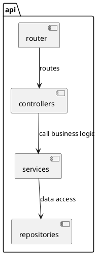
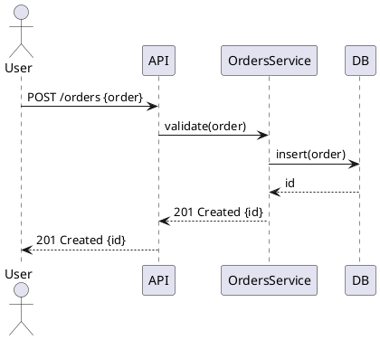
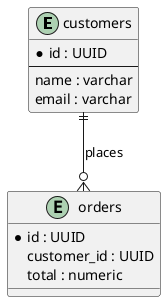
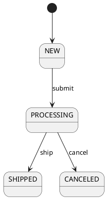

# AI-Copilot Multi-Agent System

 Copilot-style multi-agent systems to analyze a codebase deeply, extract architecture, plan and implement features, test with TDD/BDD, review and secure code, and load-test deployments. The template emphasizes *extraction* (PlantUML diagrams), *patterns*, *design-by-contract* (BDD/SOLID/KISS), *TDD*, *code quality* (Sonar/Snyk), and *performance testing* (K6/JMeter).

> ✅ Includes mandatory items: PlantUML extraction, design & implementation patterns, BDD-based planning templates, high & low-level architecture design templates, TDD implementation guidance, code review & security checks, API & load testing templates.


---
## Project Folder Layout (required)

```
.github/
├── agents/
│   ├── product-owner-business_analyst.agent.md
|   ├── computer-scientist.agent.md
│   ├── solution-architect.agent.md
│   ├── software-architect.agent.md
│   ├── software-engineer.agent.md
|   ├── devops-engineer.agent.md
│   ├── qa-engineer.agent.md
│   ├── security-engineer.agent.md
│   ├── performance-engineer.agent.md
│   ├── uiux-designer.agent.md
│   ├── manual-tester.agent.md
│   ├── automation-tester.agent.md
│   └── INSTRUCTION.MD
├── instructions/
│   ├── hive_hierarchical.prompt.md
│   ├── holonic.prompt.md
│   ├── coalition.prompt.md
│   └── INSTRUCTION.MD
├── prompts/
│   ├── rust_core.prompt.md
|   ├── c_core.prompt.md
|   ├── c++_core.prompt.md
|   ├── golang_core.prompt.md
|   ├── javascript_core.prompt.md
|   ├── bash_script.prompt.md
|   ├── java_core.prompt.md
|   ├── python_core.prompt.md
|   ├── csharp_core.prompt.md
|   ├── php_core.prompt.md
│   ├── typescript_nodejs_express.prompt.md
│   ├── uiux.design.prompt.md
│   └── INSTRUCTION.MD
└── copilot-instructions.md
```

> Each file inside `agents/`, `instructions/`, and `prompts/` must contain structured front-matter (YAML or JSON block) describing role, domain, authority, allowed tools, expected outputs, and example inputs/outputs.


---
## Top-level `copilot-instructions.md` (starter)

```yaml
---
title: "Copilot Multi-Agent Orchestrator Instructions"
version: "1.0.0"
model: "HIVE"    # default; change per repo needs
topology: "Hierarchical"
primary_language: "Golang"  # set per repo
entry_point_analysis: ["go.mod","package.json","pom.xml","build.gradle",".dockerignore","Dockerfile"]
artifacts:
  - repo_summary.md
  - architecture/
  - tests/
  - infra/
  - docs/
  - plantuml/
allowed_tools: ['runCommands','search','edit','runTasks','testFailure','fetch']
policies:
  - security_scan: 'run snyk test / sonar-scanner'
  - diagrams: 'plantuml for architecture'
  - test: 'TDD with unit & integration tests; BDD scenarios for features'
---

# High-level flow (orchestrator)
1. Repo discovery & indexing
2. Extract runtime dependencies, modules, and build system
3. Static analysis to infer architecture & patterns
4. Generate PlantUML diagrams (C4 + sequence + ERD + state)
5. Generate candidate features backlog from open issues & TODOs
6. Plan features (BDD -> acceptance tests -> tasks)
7. Implement (TDD) -> create PRs with tests
8. Run automated code review + security scans
9. Run integration & load tests
10. Report, iterate, deploy
```

---
# Agent Templates (examples)

Each agent file should follow the same structure: header → capabilities → allowed actions → example prompts → outputs.

### `agents/solution-architect.agent.md` (example)

```yaml
---
role: "Solution Architect Agent"
authority: "Can produce architecture diagrams and recommend technology changes; cannot change repo without approval"
domain: "Software_Architect"
language_focus: ["Golang","Java","Typescript"]
capabilities:
  - static_code_analysis
  - generate_plantuml_c4
  - detect_design_patterns
  - derive_class_and_sequence_diagrams
allowed_tools: ['search','runCommands','edit','fetch']
outputs:
  - plantuml/c4_component.puml
  - plantuml/c4_container.puml
  - docs/architecture.md
example_prompt: |
  "Analyze repository root and produce: 1) C4 container diagram (PlantUML), 2) component diagram, 3) sequence diagram for the API request flow 'POST /orders'."
---

# Behavior
1. Scan repository for entry points and frameworks
2. Build symbol table (services, packages, classes)
3. Map runtime components -> produce PlantUML artifacts
4. Annotate diagrams with code references (file, class, function)
```

---
## Required: PlantUML extraction templates & examples

Agents must output PlantUML files. Below are canonical templates with placeholders to be filled by code analysis agents.

### C4 Container diagram (plantuml) — `plantuml/c4_container.puml`
```plantuml
@startuml c4-container
!include https://raw.githubusercontent.com/plantuml-stdlib/C4-PlantUML/master/C4_Context.puml
LAYOUT_WITH_LEGEND()
Person(user, "User", "A user of the system")
System_Boundary(s1, "SystemName") {
  Container(api, "API Service", "Golang", "REST API and business logic")
  Container(worker, "Worker", "Golang", "Background jobs")
  Container(db, "Database", "Postgres", "Persistent storage")
  Container(cache, "Cache", "Redis", "Fast cache")
}
Rel(user, api, "Uses")
Rel(api, db, "Reads/Writes")
Rel(api, cache, "Caches")
Rel(worker, db, "Bulk writes")
@enduml
```

### Component Diagram (PlantUML) — `plantuml/component.puml`


### Sequence Diagram Example — `plantuml/sequence_order_flow.puml`


### ERD Example — `plantuml/erd.puml`


### State Machine Example — `plantuml/state_order.puml`


> Agents should annotate each PlantUML block with code references (relative file path and line numbers) so reviewers can jump to the source.


---
## Extract design patterns & algorithms (agent prompt + expected output)

### Example prompt (for `solution-architect` agent)
```
Scan repo for pattern usage and list:
- creational patterns (Factory, Builder)
- structural patterns (Adapter, Facade)
- behavioral patterns (Strategy, Observer)
- concurrency patterns (Worker pool, Reactor)
For each match, include: file path, snippet, lines, explanation, and alternatives.
```
### Expected output (structured JSON)
```json
[
  {
    "pattern": "Factory Method",
    "files": ["pkg/factory/order_factory.go"],
    "snippet": "func NewOrder(...) ...",
    "lines": "12-34",
    "explanation": "Creates order objects based on type X",
    "alternative": "Consider Builder pattern if object construction becomes complex."
  }
]
```

---
## Feature planning using BDD + SOLID + KISS (templates)

### Feature Intake Template (user input -> agent)
```yaml
title: "Create order API"
requester: "Product Owner"
priority: "P0"
description: |
  As a shopper I want to create an order so that I can purchase items.
acceptance_criteria:
  - Given a valid cart, when the shopper POST /orders, then response is 201 and order persisted
non_functional:
  - latency_p95 <= 200ms
  - throughput >= 50 req/s
security:
  - auth: JWT required
  - rate_limit: 100 req/min
```
### BDD Feature (Gherkin)
```gherkin
Feature: Create order
  As a shopper
  I want to create an order
  So that I can buy items

  Scenario: Successful order creation
    Given a valid, authenticated user with cart containing items
    When they POST /orders with valid payload
    Then the API returns 201
    And the order is persisted with items and total
    And an event "order.created" is emitted
```

### Task breakdown (auto-generated from BDD)
- API: add `POST /orders` endpoint (controller + validation)
- Service: `OrdersService.CreateOrder(ctx, payload)` (implement business rules)
- Repo: `OrderRepository.Save(order)`
- Tests: unit tests for service, integration tests for API, contract tests
- Infra: DB migration script, Rabbit/Kafka topic creation
- CI: add TDD pipeline for unit/integration tests & Sonar scanning

---
## Implementation & TDD guidance (templates)

### TDD workflow for a feature
1. Write failing unit test (edge cases + happy path)
2. Implement minimal code to pass tests
3. Refactor for readability and SOLID design
4. Run static and security scans (Sonar & Snyk)
5. Add integration tests (Testcontainers or equivalent)
6. Add contract tests if public API exists
7. Add performance tests for NFRs (k6/JMeter/Locust)

### Example unit test template (Golang)
```go
func TestCreateOrder_Success(t *testing.T) {
  // setup: mock repo, validator
  // arrange: valid payload
  // act: call service.CreateOrder
  // assert: returned id != "", no error, repo.Save called once
}
```

### Example integration test using Testcontainers (Golang)
```go
// Start Postgres container
// Run migrations
// Seed test data
// Start API server on random port
// Hit POST /orders and assert 201 + DB persisted record
```

---
## Code Review & Quality Checklist (to be automated by `reviewer` agent)

- ✅ Style: follows project lint rules (gofmt/golint/eslint/prettier)
- ✅ Complexity: cyclomatic complexity < threshold (e.g. 15)
- ✅ Readability: function < 200 lines, modules cohesive
- ✅ SOLID: Single Responsibility & Interface segregation verified
- ✅ Tests: coverage target met (e.g. 80% for critical packages)
- ✅ Security: no hardcoded secrets, safe use of crypto libs
- ✅ Vulnerabilities: run `snyk test` and remediate high/critical
- ✅ Static Analysis: run `sonar-scanner` with acceptable gate
- ✅ Dependency: no outdated dependencies with known CVEs
- ✅ Documentation: public methods have docstrings and README updated
- ✅ CI: pipeline enforces quality gates

### Commands (examples)
```bash
# run lint
gofmt -w . && golangci-lint run ./...
# run unit tests
go test ./... -coverprofile=coverage.out
# run sonar
sonar-scanner -Dsonar.projectKey=repo
# run snyk (requires snyk auth)
snyk test
```

---
## Security & Snyk integration (agent expectations)

- Agent runs `snyk test` and `snyk monitor` and report vulnerabilities with remediation steps.
- Check Snyk PR checks for introduced vulnerable deps.
- Recommend minimal patches or upgrades; if risky, propose short-term mitigation (e.g., add WAF rules).

---
## API testing & Load testing templates

### K6 script (simple)
```javascript
import http from 'k6/http';
import { check, sleep } from 'k6';

export let options = {
  vus: 50,
  duration: '1m',
  thresholds: {
    http_req_duration: ['p(95)<200'],
    http_req_failed: ['rate<0.01'],
  },
};

export default function () {
  var payload = JSON.stringify({ /* sample payload */ });
  var headers = { 'Content-Type': 'application/json', 'Authorization': 'Bearer ${TOKEN}' };
  let res = http.post('https://api.example.com/orders', payload, { headers });
  check(res, { 'status is 201': (r) => r.status === 201 });
  sleep(1);
}
```

### JMeter / Locust templates
- Provide JMeter `.jmx` or Locust python tasks under `tests/performance/` produced by the performance agent.


---
## Reporting & Artifacts (what agents must produce)

- `docs/repo_summary.md` — human-readable summary for PO/PM
- `docs/architecture.md` — architecture narrative and references to plantuml files
- `plantuml/*.puml` — generated diagrams (C4, containers, components, sequences, ERD, states)
- `tests/unit/*.go` or `tests/unit/*.js` — TDD unit tests
- `tests/integration/*` — integration test suites (using Testcontainers or equivalent)
- `tests/performance/*` — k6/jmeter/locust scripts and results
- `ci/` — pipeline configs to run tests, code quality, sonar and snyk gates
- `reports/security/` — vulnerability report (Snyk)
- `reports/coverage/` — test coverage and lines covered report

---
## Example: Automated Feature Flow (Agent Collaboration)

1. **Discovery Agent** scans repo, builds index, and outputs `repo_index.json`.
2. **Architect Agent** creates `plantuml/*` diagrams and `docs/architecture.md`.
3. **BA Agent** uses issue tracker + product input to generate feature backlog with BDD scenarios.
4. **Planning Agent** splits features into tasks, calculates estimates and produces Gantt/RACI outputs.
5. **Dev Agent** writes tests (unit/integration) and minimal implementation per TDD.
6. **CI Agent** runs pipeline, sonar, snyk, and performance tests; fails PRs on gate violations.
7. **QA Agent** runs automation tests and exploratory test sessions, records results under `reports/qa/`.
8. **Release Agent** orchestrates deployment to staging and production with DB migrations & canary rollout.

---
## Example: Agent Prompt Snippets (ready-to-use)

### Discovery Agent prompt
```
"Scan repo root. Produce: 1) list of modules and frameworks; 2) entry points; 3) DB schemas; 4) a prioritized list of TODOs and feature candidates (with probable owner). Output as JSON and save to docs/repo_index.json"
```

### Dev Agent prompt (implement feature)
```
"Implement feature: Create order API. Use TDD. 1) create failing unit tests in tests/unit/orders_test.go; 2) implement minimal code; 3) run tests; 4) refactor; 5) create PR with description listing tests and coverage results."
```

### QA Agent prompt (automation)
```
"Run integration tests in tests/integration; if service runs, run Postman/Newman collection and k6 quick smoke tests; attach results to reports/qa/. If any test fails, create an issue with logs and reproduce steps."
```

---
## CI/CD and Deployment Hooks (recommended patterns)

- Use pipeline gates: unit -> integration -> static analysis (lint/sonar) -> security (snyk) -> performance -> deploy
- Use testcontainers for integration tests in CI
- Use canary deployments for production with feature flags
- Add health checks, readiness, and liveness endpoints for orchestration

---
## Appendix: Useful Snippets (searchable by agents)

- PlantUML C4 examples
- BDD (Gherkin) feature examples
- TDD test skeletons per language (Golang, Java, Typescript)
- Sonar & Snyk CLI usage
- K6 and JMeter quickstart

---
## How to use this template (practical steps for a Copilot multi-agent orchestrator)

1. Set `primary_language` in `copilot-instructions.md`.
2. Run Discovery Agent to produce `repo_index.json` and `docs/repo_summary.md`.
3. Run Architect Agent to create `plantuml/` diagrams.
4. Run BA Agent to generate BDD scenarios and backlog items.
5. For each top-priority feature: run Planning -> Dev -> QA -> CI flow.
6. Ensure PRs include tests and pass Sonar & Snyk gates before merge.

---
# License: MIT
# Generated: automated fine-tuned template for multi-agent Copilot systems
