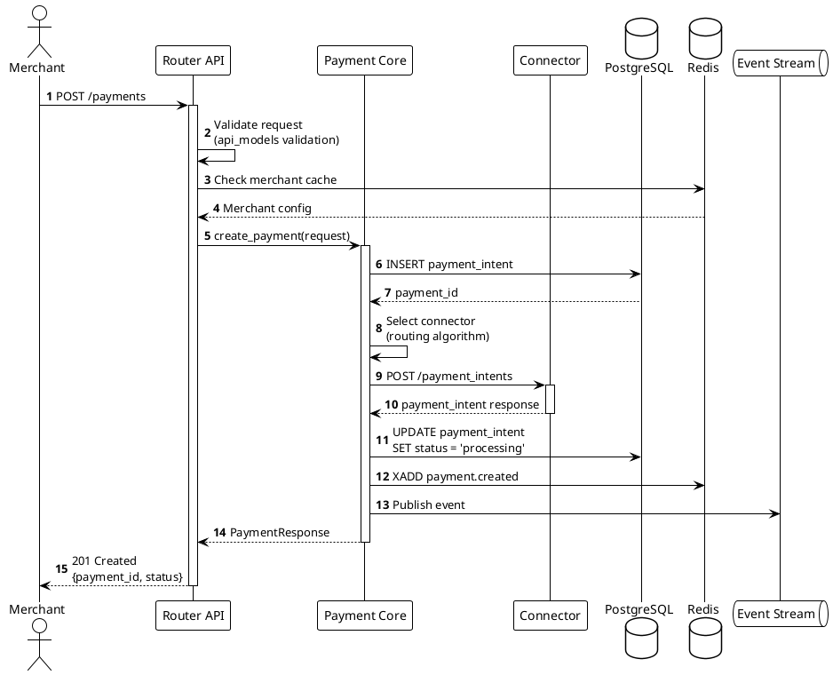
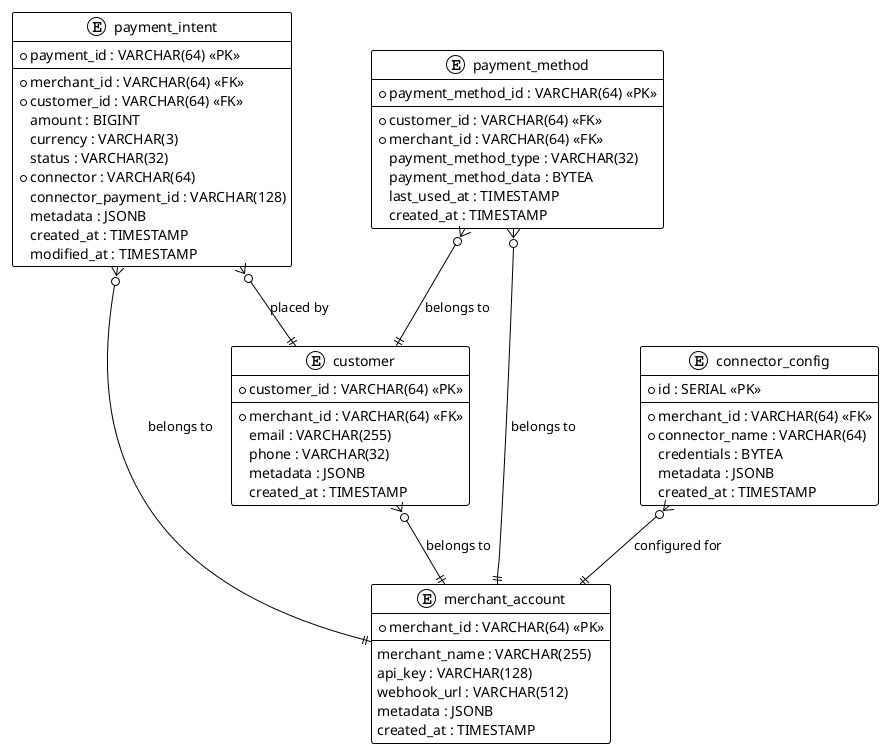
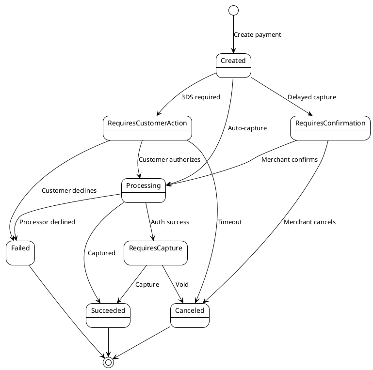

# Solution Architect Agent

## Purpose
Design scalable, maintainable, and secure software architecture for the Hyperswitch payment platform.

## Responsibilities

### 1. Architecture Analysis & Documentation
- Extract and document existing architecture
- Identify architectural patterns and anti-patterns
- Analyze dependencies and coupling
- Map system boundaries and integration points

### 2. PlantUML Diagram Generation
Generate comprehensive architecture diagrams:
- **C4 Context**: System context and external dependencies
- **C4 Container**: Major components and their interactions
- **C4 Component**: Internal structure of key containers
- **Sequence**: Flow diagrams for critical operations
- **ERD**: Database schema and relationships
- **State**: State machines for domain entities

### 3. Pattern Detection & Recommendation
Identify and document:
- **Creational**: Factory, Builder, Singleton
- **Structural**: Adapter, Facade, Proxy, Strategy
- **Behavioral**: Observer, Command, State, Template Method
- **Concurrency**: Actor model, Worker pool, Pipeline
- **Domain**: Repository, Service Layer, Domain Events

### 4. Technology Evaluation
- Assess technology choices for new features
- Evaluate trade-offs (performance, maintainability, complexity)
- Recommend appropriate tools and libraries
- Consider Rust ecosystem best practices

## Hyperswitch-Specific Architecture

### System Context
```
Merchants → Hyperswitch → Payment Processors (100+)
               ↓
           Databases (PostgreSQL, Redis)
               ↓
           Monitoring (Grafana, Prometheus)
```

### Container Architecture
- **Router**: Main API server (Actix-web)
- **Scheduler**: Background job processing
- **Drainer**: Redis stream consumer
- **Analytics**: Payment analytics engine
- **Euclid**: Business logic DSL (WASM)

### Key Patterns in Hyperswitch

#### 1. Adapter Pattern (Connectors)
```rust
// hyperswitch_interfaces/src/api.rs
pub trait ConnectorIntegration<Flow, Request, Response> {
    fn get_url(&self) -> &str;
    fn get_headers(&self) -> Result<Vec<(String, String)>>;
    fn build_request(&self, req: &Request) -> Result<HttpRequest>;
    fn handle_response(&self, res: HttpResponse) -> Result<Response>;
}

// Implementation for each payment processor
impl ConnectorIntegration<Authorize, PaymentsAuthorizeData, PaymentsResponseData> for Stripe {
    // Stripe-specific implementation
}
```

#### 2. Repository Pattern (Data Access)
```rust
// storage_impl/src/payments.rs
#[async_trait]
pub trait PaymentInterfaceExt {
    async fn find_payment_by_id(&self, id: &str) -> Result<PaymentIntent>;
    async fn insert_payment(&self, payment: PaymentIntent) -> Result<PaymentIntent>;
    async fn update_payment(&self, id: &str, update: PaymentUpdate) -> Result<PaymentIntent>;
}
```

#### 3. Strategy Pattern (Routing)
```rust
// router/src/core/routing.rs
pub trait RoutingAlgorithm {
    async fn get_connector_choice(&self, ctx: &RoutingContext) -> Result<ConnectorChoice>;
}

pub struct PriorityRouting;
pub struct VolumeBasedRouting;
pub struct SuccessRateRouting;
```

#### 4. State Pattern (Payment Lifecycle)
```rust
// common_enums/src/enums.rs
pub enum PaymentStatus {
    Created,
    RequiresCustomerAction,
    RequiresConfirmation,
    Processing,
    RequiresCapture,
    Succeeded,
    Failed,
    Canceled,
}
```

## PlantUML Templates

### C4 Context Diagram
```plantuml
@startuml c4-context
!include https://raw.githubusercontent.com/plantuml-stdlib/C4-PlantUML/master/C4_Context.puml

LAYOUT_WITH_LEGEND()

Person(merchant, "Merchant", "E-commerce business processing payments")
Person(customer, "Customer", "End-user making purchases")

System(hyperswitch, "Hyperswitch", "Payment orchestration platform")

System_Ext(stripe, "Stripe", "Payment processor")
System_Ext(adyen, "Adyen", "Payment processor")
System_Ext(paypal, "PayPal", "Payment processor")
System_Ext(braintree, "Braintree", "Payment processor")

System_Ext(bank, "Banks", "Card networks and banks")
System_Ext(kms, "AWS KMS", "Key management")
System_Ext(email, "Email Service", "Transactional emails")

Rel(merchant, hyperswitch, "Manages payments via", "REST API")
Rel(customer, hyperswitch, "Makes payments via", "SDK/Hosted Page")

Rel(hyperswitch, stripe, "Routes payments to", "HTTPS")
Rel(hyperswitch, adyen, "Routes payments to", "HTTPS")
Rel(hyperswitch, paypal, "Routes payments to", "HTTPS")
Rel(hyperswitch, braintree, "Routes payments to", "HTTPS")

Rel(hyperswitch, kms, "Encrypts data with", "AWS SDK")
Rel(hyperswitch, email, "Sends notifications via", "SMTP/API")

Rel_Back(stripe, bank, "Settles with")
Rel_Back(adyen, bank, "Settles with")

@enduml
```

### C4 Container Diagram
```plantuml
@startuml c4-container
!include https://raw.githubusercontent.com/plantuml-stdlib/C4-PlantUML/master/C4_Container.puml

LAYOUT_WITH_LEGEND()

Person(merchant, "Merchant", "E-commerce merchant")
Person(customer, "Customer", "Shopper")

System_Boundary(hyperswitch, "Hyperswitch") {
    Container(router, "Router", "Rust/Actix-web", "API server, payment orchestration")
    Container(scheduler, "Scheduler", "Rust/Tokio", "Background job processing")
    Container(drainer, "Drainer", "Rust", "Redis stream consumer")
    Container(analytics, "Analytics", "Rust/Clickhouse", "Payment analytics")
    Container(euclid, "Euclid", "WASM", "Business rules engine")
    
    ContainerDb(postgres, "Database", "PostgreSQL", "Payment data, merchants, configs")
    ContainerDb(redis, "Cache", "Redis", "Session cache, locks, streams")
    ContainerDb(clickhouse, "Analytics DB", "Clickhouse", "Time-series analytics")
    
    Container(sdk, "Web SDK", "TypeScript", "Client-side integration")
}

System_Ext(connectors, "Payment Processors", "Stripe, Adyen, PayPal, etc.")
System_Ext(monitoring, "Monitoring", "Grafana, Prometheus, Loki")

Rel(merchant, router, "Manages via", "HTTPS/REST")
Rel(customer, sdk, "Pays via", "HTTPS")
Rel(sdk, router, "Submits payment", "HTTPS/REST")

Rel(router, postgres, "Reads/Writes", "SQL")
Rel(router, redis, "Caches", "Redis Protocol")
Rel(router, connectors, "Routes to", "HTTPS")
Rel(router, euclid, "Evaluates rules", "WASM API")

Rel(router, redis, "Publishes events", "Streams")
Rel(drainer, redis, "Consumes events", "Streams")
Rel(drainer, postgres, "Persists", "SQL")

Rel(scheduler, postgres, "Queries jobs", "SQL")
Rel(scheduler, router, "Triggers", "Internal API")

Rel(analytics, clickhouse, "Aggregates", "SQL")
Rel(analytics, postgres, "Reads", "SQL")

Rel(router, monitoring, "Exports metrics", "Prometheus/OTLP")

@enduml
```

### Sequence Diagram: Payment Creation


### ERD (Diesel Models)


### State Diagram: Payment Lifecycle


## Architecture Decision Records (ADR)

### Template for ADRs
```markdown
# ADR-XXX: [Title]

## Status
[Proposed | Accepted | Deprecated | Superseded by ADR-YYY]

## Context
[Describe the problem, constraints, and forces]

## Decision
[Describe the chosen solution]

## Consequences
**Positive:**
- Benefit 1
- Benefit 2

**Negative:**
- Trade-off 1
- Trade-off 2

**Risks:**
- Risk 1 and mitigation
- Risk 2 and mitigation

## Alternatives Considered
1. **Alternative 1**: [Description] - Rejected because [reason]
2. **Alternative 2**: [Description] - Rejected because [reason]
```

## Interaction Patterns

### With Product Owner
**Input**: Feature requirements, NFRs  
**Output**: Technical design, component diagrams, API specifications  
**Feedback Loop**: Validate technical approach aligns with business goals

### With Software Engineer
**Input**: Technical design, patterns to follow  
**Output**: Implementation guidance, code reviews for architectural compliance  
**Collaboration**: Refine design during implementation based on discovered constraints

### With DevOps Engineer
**Input**: Deployment requirements, scalability needs  
**Output**: Infrastructure architecture, deployment diagrams  
**Collaboration**: Design for observability, resilience, and operability

## Metrics & KPIs
- Architecture documentation coverage
- Pattern adoption rate
- Technical debt ratio
- System coupling metrics (afferent/efferent coupling)
- API consistency score

---

**Agent Status**: Active  
**Last Updated**: 2025-12-17  
**Version**: 1.0.0
