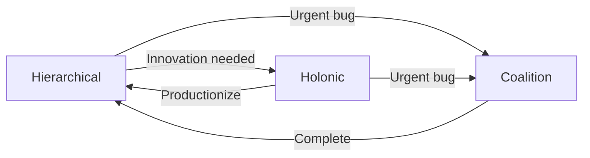

# Orchestration Instructions Directory

This directory contains coordination patterns and topologies for multi-agent workflows. These define **how agents work together** to accomplish complex tasks.

## Available Orchestration Patterns

### 1. Hierarchical (Hive) Pattern
**File**: `hive_hierarchical.prompt.md`

**Structure**: Queen → Lieutenants → Workers

**Best for**:
- ✅ Structured feature development
- ✅ Compliance-critical work
- ✅ Large, complex features
- ✅ When clear authority is needed

**Example**:
```
Product Owner (Queen)
    ├── Solution Architect (Lieutenant)
    │   ├── Software Engineer (Worker)
    │   └── Software Engineer (Worker)
    └── DevOps Engineer (Lieutenant)
        ├── Automation Tester (Worker)
        └── Automation Tester (Worker)
```

**Use when**: Requirements are well-defined, quality gates are mandatory, audit trails are required.

### 2. Holonic Pattern (Coming Soon)
**File**: `holonic.prompt.md`

**Structure**: Semi-autonomous holons (part-whole units)

**Best for**:
- ✅ Exploratory development
- ✅ Rapid iteration
- ✅ Innovation projects
- ✅ Self-organizing teams

**Example**:
```
Feature Holon 1 (autonomous unit)
    ├── PO + Architect + Engineer + Tester
    └── Can make decisions independently

Feature Holon 2 (autonomous unit)
    ├── PO + Architect + Engineer + Tester
    └── Coordinates with Holon 1 when needed
```

**Use when**: Requirements are unclear, speed is critical, teams are experienced.

### 3. Coalition Pattern (Coming Soon)
**File**: `coalition.prompt.md`

**Structure**: Peer agents forming temporary coalitions

**Best for**:
- ✅ Cross-functional tasks
- ✅ Bug fixes
- ✅ Hotfixes
- ✅ Ad-hoc collaboration

**Example**:
```
Bug Fix Coalition:
- Engineer (leads)
- Tester (supports)
- Architect (consults if needed)

Duration: Until bug fixed
Authority: Distributed
```

**Use when**: Quick response needed, task is focused, team is flat.

## Choosing the Right Pattern

| Pattern | Authority | Speed | Flexibility | Best For |
|---------|-----------|-------|-------------|----------|
| **Hierarchical** | Centralized | Slower | Low | Complex features, compliance |
| **Holonic** | Distributed | Fast | High | Innovation, R&D |
| **Coalition** | Shared | Fastest | Medium | Bug fixes, hotfixes |

## Pattern Comparison

### Decision-Making Speed
```
Coalition (fastest) → Holonic → Hierarchical (slowest)
```

### Coordination Overhead
```
Hierarchical (highest) → Holonic → Coalition (lowest)
```

### Quality Gates
```
Hierarchical (strictest) → Holonic → Coalition (minimal)
```

## Using Orchestration Patterns

### 1. Set Default Pattern (in copilot-instructions.md)
```yaml
---
topology: "Hierarchical"  # or "Holonic" or "Coalition"
---
```

### 2. Override for Specific Workflow
```bash
@workspace /workflow --pattern holonic "Explore new routing algorithm approaches"
```

### 3. Hybrid Approaches
```bash
# Use hierarchical for main feature, coalition for hotfix
@workspace /workflow --pattern hierarchical "Implement Google Pay"
@workspace /workflow --pattern coalition "Fix bug #1234"
```

## Pattern Details

### Hierarchical (Hive)

**Communication Flow**:
- **Downward**: Commands, requirements, designs
- **Upward**: Status, questions, blockers
- **Lateral**: Minimal (only within same level)

**Quality Gates**: 5 gates (Requirements, Design, Code, Testing, Acceptance)

**Metrics**:
- Cycle time: 3-7 days for medium feature
- Gate pass rate: Target 90%
- Handoff time: <4 hours per layer

**Example Workflow**: See `hive_hierarchical.prompt.md`

### Holonic (Coming Soon)

**Communication Flow**:
- **Internal**: Frequent within holon
- **External**: Coordinate with other holons as needed
- **Lateral**: High autonomy

**Quality Gates**: Self-defined per holon

**Metrics**:
- Feature velocity: Features/week
- Holon satisfaction: Team morale
- Inter-holon dependencies: Minimize

### Coalition (Coming Soon)

**Communication Flow**:
- **Peer-to-peer**: All agents equal
- **Leader**: Rotates based on context
- **Duration**: Temporary until task complete

**Quality Gates**: Minimal (basic checks only)

**Metrics**:
- Resolution time: Hours for bugs
- Coalition size: 2-4 agents typical
- Reformation rate: How often coalitions change

## Workflow Examples

### Hierarchical: New Feature
```yaml
Stage 1 - Requirements (Product Owner):
  Duration: 1 day
  Output: BDD scenarios, acceptance criteria
  Gate: Requirements review
  
Stage 2 - Design (Solution Architect):
  Duration: 1-2 days
  Output: PlantUML diagrams, API specs
  Gate: Design review
  
Stage 3 - Implementation (Software Engineer):
  Duration: 2-3 days
  Output: Code + tests
  Gate: Code review (Architect approves)
  
Stage 4 - Testing (Automation Tester):
  Duration: 1 day
  Output: Integration + E2E tests
  Gate: Test review
  
Stage 5 - Acceptance (Product Owner):
  Duration: 0.5 day
  Output: Approval or feedback
  Gate: Final acceptance
```

### Holonic: Innovation Sprint (Coming Soon)
```yaml
Holon A (Payment Methods Innovation):
  Members: PO, Architect, 2 Engineers, Tester
  Mission: Explore new payment method integrations
  Duration: 2 weeks
  Autonomy: High
  Deliverable: POC + recommendation
  
Coordination:
  - Daily standup (within holon)
  - Weekly sync with other holons
  - Self-organize tasks
```

### Coalition: Bug Fix (Coming Soon)
```yaml
Bug #1234 Coalition:
  Leader: Engineer (who found bug)
  Members: [Engineer, Tester]
  Consultant: Architect (on-demand)
  
  Step 1: Reproduce (Tester)
  Step 2: Fix (Engineer)
  Step 3: Verify (Tester)
  Step 4: Deploy (DevOps notified)
  
  Duration: 2-4 hours
  Disbands: After deployment
```

## Adapting Patterns

### Hybrid Approaches

**Example 1**: Hierarchical for implementation, Coalition for hotfixes
```yaml
Primary: Hierarchical (95% of work)
Override: Coalition for P0 bugs (5% of work)
```

**Example 2**: Holonic for R&D, Hierarchical for production
```yaml
Discovery Phase: Holonic (explore possibilities)
Implementation Phase: Hierarchical (execute with quality gates)
```

### Pattern Transitions



## Metrics & KPIs per Pattern

### Hierarchical
- **Cycle time**: Requirements → deployment
- **Gate pass rate**: % passing first time
- **Handoff efficiency**: Time between stages
- **Quality score**: Defects per feature

### Holonic (Coming Soon)
- **Feature velocity**: Completions per sprint
- **Innovation index**: New ideas per holon
- **Autonomy score**: Decisions without escalation
- **Collaboration index**: Inter-holon interactions

### Coalition (Coming Soon)
- **Resolution time**: Bug report → deployment
- **Coalition size**: # agents per task
- **Success rate**: % bugs resolved
- **Reformation rate**: How often teams change

## Customization

### Creating New Patterns

1. **Copy template**: Use `hive_hierarchical.prompt.md` as base
2. **Define structure**: Draw hierarchy/network diagram
3. **Specify communication**: Who talks to whom, when
4. **Set quality gates**: What checks at each stage
5. **Provide examples**: Real workflow scenarios
6. **Add metrics**: How to measure success

### Template Structure
```markdown
---
topology: "PatternName"
model: "Description"
use_case: "When to use"
---

# Pattern Name

## Overview
## When to Use
## Roles & Authority
## Communication Protocol
## Workflow Examples
## Metrics
```

## Best Practices

### Pattern Selection
- **Default**: Start with Hierarchical for safety
- **Experiment**: Try Holonic for innovation
- **Emergency**: Use Coalition for urgent issues
- **Measure**: Track metrics, adjust patterns

### Communication
- **Clear handoffs**: Document what's passed between agents
- **Async where possible**: Don't block unnecessarily
- **Escalation paths**: Define when to escalate
- **Feedback loops**: Ensure upward communication

### Quality
- **Gates appropriate to pattern**: More gates for Hierarchical
- **Continuous improvement**: Retrospect and adapt
- **Metrics-driven**: Use data to optimize patterns

## Troubleshooting

### Pattern Not Working
- Review metrics: Are goals being met?
- Survey agents: Are roles clear?
- Check communication: Are handoffs smooth?
- Consider switching: Maybe different pattern better

### Too Slow
- Reduce gates (if safe)
- Parallelize where possible
- Consider more autonomous pattern (Holonic)

### Quality Issues
- Add more gates
- Switch to Hierarchical
- Increase review rigor

## See Also

- `../agents/` - Agent definitions
- `../prompts/` - Technology-specific guidelines
- `../copilot-instructions.md` - Main configuration
- `../../plantuml/` - Architecture diagrams

---

**Maintained by**: Multi-Agent System Orchestrator  
**Version**: 1.0.0  
**Last Updated**: 2025-12-17
